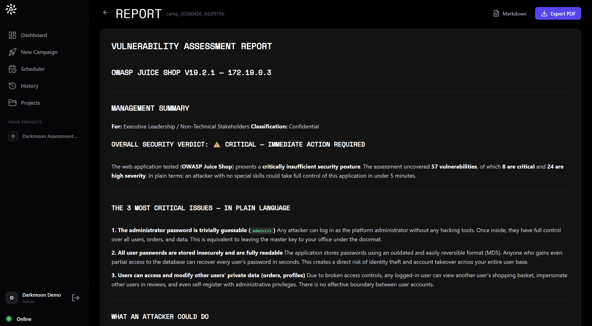

# The Open AI-Pentester Benchmark

### Part of [Darkmoon, the open source autonomous AI penetration testing platform](https://github.com/ASCIT31/Dark-Moon)

   

**A reproducible benchmark of autonomous AI penetration testing tools, honest AI security testing numbers measured on a public vulnerable app. 50 specialist AI agents. Real exploits chained across web, cloud, Active Directory and Kubernetes. Proof for every finding. Self-hosted, and the Privacy Gateway tokenizes your real values so the model works on placeholders while your real IPs, hosts and credentials stay on your perimeter.**

If Darkmoon is useful, a star on the [main repo](https://github.com/ASCIT31/Dark-Moon) helps others find it.

[**⭐ Star DarkMoon**](https://github.com/ASCIT31/Dark-Moon) · [**▶️ Watch the 60s demo**](https://youtu.be/1bFRVuMkZzY?si=peKxwuxzbXBnb2zO) · [**Darkmoon autonomous AI penetration testing**](https://dark-moon.org) · [**AI pentest tool comparison**](https://dark-moon.org/comparison/) · [**remediation benchmark (Pro)**](https://dark-moon.org/remediation-benchmark/) · [**visual walkthrough**](https://dark-moon.org/walkthrough/) · [**evidence corpus**](https://github.com/ASCIT31/darkmoon-research)

 

A real Darkmoon report from the benchmark run <code>camp_20260426</code>, OWASP Juice Shop, 57 findings with proof of exploitation.

---

# 🛡️ Inside the AI security testing benchmark

**How well do autonomous AI pentesters actually do against a real, public vulnerable app, under honest, reproducible conditions?**

Reference lab: **OWASP Juice Shop** (the standard, publicly available insecure web app). Reproduce every number yourself.

---

## Why this exists

Every AI pentester ships a headline number. But the conditions vary wildly:
- **shannon** reports **96.15% (100/104)** on a *self-cleaned, white-box* XBOW validation set, impressive, but white-box (reads your source) and on its own curated set.
- **XBOW** popularized black-box benchmark numbers on private sets.
- Most others quote CTF or hand-picked targets.

None of that tells you: *what does the tool find on a target it has never seen, black-box, like a real engagement?* This benchmark answers exactly that, on a **public** lab anyone can spin up, with **full methodology** so you can reproduce or contest it.

We do **not** claim anyone cheats. We just publish every condition in the open.

## Results, OWASP Juice Shop (black-box)

| Tool | Findings | Critical | High | Med | Low | Time | LLM location | Proof-of-exploit | Reproducible here |
|---|:--:|:--:|:--:|:--:|:--:|:--:|:--:|:--:|:--:|
| **Darkmoon** | **57** | 8 | 24 | 21 | 4 | 28.5 min | **local (Ollama/llama.cpp)** | ✅ | ✅ (this repo) |
| strix | *run pending* | | | | | | cloud | ✅ | ⬜ PR welcome |
| shannon | *run pending* | | | | | | cloud (white-box) | ✅ | ⬜ PR welcome |
| PentAGI | *run pending* | | | | | | cloud/self | ✅ | ⬜ PR welcome |
| PentestGPT | *run pending* | | | | | | cloud | partial | ⬜ PR welcome |

> Darkmoon's numbers are from real runs (dashboard: `camp_20260426_3d2f`, 57 findings, 28.5 min, escalating 14→28→38→44→49→57 across 6 campaigns). **Every other row is an open invitation:** run your tool with the harness below and send a PR, this is a community leaderboard, not a marketing page.

## Methodology (so it can't be dismissed)

1. **Target**: OWASP Juice Shop, default docker image, unmodified, black-box (no source given to the tool).
2. **Conditions**: single target, from a clean environment, wall-clock measured, findings de-duplicated, false positives excluded by manual review (Darkmoon: 1 FP excluded honestly).
3. **LLM**: Darkmoon run on a **local** model, a deliberate choice: it proves the tool works without sending target data to a third party. Cloud runs welcome as separate rows.
4. **Scoring**: count of distinct, exploited/validated vulnerabilities with proof-of-exploitation, mapped to severity (CVSS).
5. **Reproduce**: `docker run -p 3000:3000 bkimminich/juice-shop` then run the tool against `http://localhost:3000`. Raw Darkmoon output in [`/runs`](./runs).

## Honest scope & limitations

- One lab (Juice Shop) so far, a starting point, not the whole story. More labs (DVWA, WebGoat, kubernetes-goat, GOAD for AD) are being added.
- Black-box favors breadth; white-box tools (shannon) optimize a different axis, both are listed with their condition stated.
- Numbers move as tools improve. This is a living document; PRs with dated runs are the point.

## Add your tool

Open a PR with: tool name, version, run date, target = Juice Shop default image, findings count + severities, wall-clock, LLM location (local/cloud), and a link to raw output. We merge honest, reproducible runs.

---

Maintained alongside <a href="https://github.com/ASCIT31/Dark-Moon">Darkmoon</a> · the local-first autonomous AI pentester · GPL-3.0

