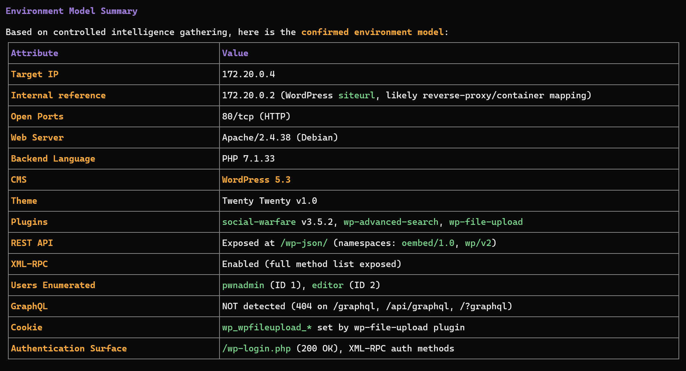
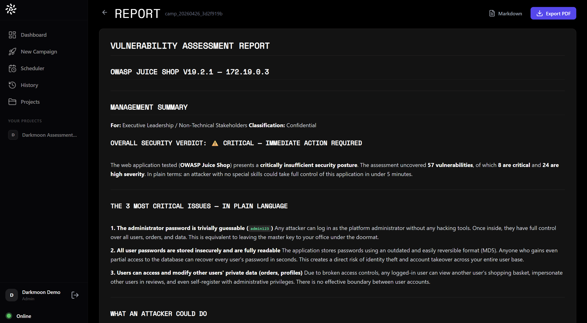

# The Autonomous AI Penetration Testing Benchmark

### An honest AI security testing benchmark, part of [Darkmoon, the open source autonomous AI penetration testing platform](https://github.com/ASCIT31/Dark-Moon)

**⭐ If this autonomous AI penetration testing benchmark is useful, [star the main Darkmoon repo](https://github.com/ASCIT31/Dark-Moon), it is how others find the project.**

   

**A reproducible, black-box benchmark of Darkmoon on public, named vulnerable labs, with the full method published and the raw run linked so you can reproduce or contest every number.** 50 specialist AI agents, real exploits chained across web, cloud, infrastructure and IoT, proof for every finding, self-hosted, with the Privacy Gateway tokenizing your real values so the model works on placeholders while your real IPs, hosts and credentials stay on your perimeter.

If Darkmoon is useful, a star on the [main repo](https://github.com/ASCIT31/Dark-Moon) helps others find it.

[**⭐ Star DarkMoon**](https://github.com/ASCIT31/Dark-Moon) · [**🏆 Leaderboard**](./runs/index.md) · [**📄 Raw Juice Shop run**](./runs/juice-shop-2026-04-26.md) · [**▶️ Watch the 60s demo**](https://youtu.be/1bFRVuMkZzY?si=peKxwuxzbXBnb2zO) · [**Darkmoon autonomous AI penetration testing**](https://dark-moon.org) · [**remediation benchmark (Pro)**](https://dark-moon.org/remediation-benchmark/) · [**visual walkthrough**](https://dark-moon.org/walkthrough/) · [**evidence corpus**](https://github.com/ASCIT31/darkmoon-research)

 

The open source Darkmoon CLI, its terminal environment model, ports, web server, CMS, plugins and enumerated users recovered black-box during a benchmark run.

 

<b>Pro:</b> the paid Darkmoon Pro web dashboard rendering a benchmark report (<code>camp_20260426</code>, OWASP Juice Shop, 57 findings).

<b>Web dashboard and remediation are Darkmoon Pro (paid) features; the open source edition is the CLI shown above.</b>

---

# 🛡️ Inside the AI security testing benchmark

**How well does an autonomous AI pentester actually do against a real, public vulnerable app, under honest, reproducible conditions?**

Reference lab: **OWASP Juice Shop** (the standard, publicly available insecure web app). Reproduce every number yourself.

---

## Why this exists

Headline security numbers are easy to quote and hard to trust, because the conditions behind them usually go unstated: white-box (the tool reads your source) versus black-box, a curated private set versus a public target, a cloud model versus a local one, confirmed findings versus findings proved by an actual exploit.

This benchmark takes the opposite approach. It runs Darkmoon on **public labs anyone can spin up**, black-box (no source given to the tool), and publishes **every condition and the full method** so the numbers can be quoted, reproduced, or contested. Nothing here is a claim about any other tool. It is a record of what Darkmoon found, with the raw run attached.

## Results, OWASP Juice Shop (black-box)

| Tool | Findings | Critical | High | Med | Low | Time | LLM location | Proof-of-exploit | Reproducible here |
|---|:--:|:--:|:--:|:--:|:--:|:--:|:--:|:--:|:--:|
| **Darkmoon** | **57** | 8 | 24 | 21 | 4 | 28.5 min | **local (Ollama/llama.cpp)** | ✅ | ✅ (this repo) |

> Darkmoon's numbers are from real runs (dashboard: `camp_20260426_3d2f`, 57 findings, 28.5 min, escalating 14 → 28 → 38 → 44 → 49 → 57 across 6 weekly campaigns against the same target). Raw run: [`runs/juice-shop-2026-04-26.md`](./runs/juice-shop-2026-04-26.md).

> Of the 57 findings, 42 were auto-remediated to reviewed pull requests. That remediation-to-PR step is a Darkmoon **Pro** (paid) feature, so 42 of 57 is a Pro-tier result. The open source CLI produces the finding and the proof of exploitation for all 57.

> This is a living leaderboard, not a marketing page. To add another tool or lab, see [Add your tool](#add-your-tool), open a PR with a named target and a link to raw output, and we will merge honest, reproducible runs.

## The multi-surface leaderboard (real runs across web, cloud, infra, IoT)

Juice Shop is the reference web lab. Beyond it, Darkmoon has been run against named, reproducible cloud, infrastructure and IoT labs, and each run has a full report with one section per finding and evidence. The **[benchmark leaderboard](./runs/index.md)** is the single index of every run, with per-severity finding counts and exploited counts pulled directly from each report.

| Surface | Labs | Findings | Exploited |
|---|:--:|:--:|:--:|
| web (OWASP Juice Shop) | 1 | 57 | proof per finding |
| cloud (AWS, Azure, GCP) | 8 | 97 | 45 |
| infrastructure (databases, CI/CD, secret stores, IaC) | 6 | 135 | 47 |
| iot (OWASP IoTGoat) | 2 | 29 | 4 |

Across the 16 named cloud, infrastructure and IoT reports: **261 findings, 96 of them proved by active exploitation**. The web run adds **57 findings** with proof of exploitation per finding. Every number above is copied from a real report. The full per-lab reports live in the [darkmoon-research](https://github.com/ASCIT31/darkmoon-research) evidence corpus, and the [leaderboard](./runs/index.md) links each row straight to its report. Finding and proof are the open source CLI's job (local, black-box, privacy-preserving); the web dashboard and automated remediation are Darkmoon **Pro** (paid) features.

[**⭐ Star Darkmoon, the open source autonomous AI penetration testing platform**](https://github.com/ASCIT31/Dark-Moon) · [**Open the full leaderboard**](./runs/index.md)

## Methodology (so it can't be dismissed)

1. **Target**: OWASP Juice Shop, default docker image, unmodified, black-box (no source given to the tool).
2. **Conditions**: single target, from a clean environment, wall-clock measured, findings de-duplicated, false positives excluded by manual review before counting (see the verification section below).
3. **LLM**: the Juice Shop run used a **local** model (Ollama/llama.cpp), a deliberate choice: it proves the tool works without sending target data to a third party. The cloud, infrastructure and IoT lab reports were recorded on a cloud model, and each row's model is labeled in the leaderboard.
4. **Scoring**: count of distinct, exploited or validated vulnerabilities with proof-of-exploitation, mapped to severity (CVSS).
5. **Reproduce**: `docker run -p 3000:3000 bkimminich/juice-shop`, then run the tool against `http://localhost:3000`. Raw Darkmoon output for the reference run is in [`runs/juice-shop-2026-04-26.md`](./runs/juice-shop-2026-04-26.md), and the full [`/runs`](./runs) index links every lab to its report.

## False positives & verification

Every number in this benchmark is a count of **distinct vulnerabilities that survived verification**, not raw tool output. The verification method is:

- **Proof-of-exploitation required.** For the reference Juice Shop run, every one of the 57 findings carries proof of exploitation per finding. Across the cloud, infrastructure and IoT labs, the leaderboard reports a separate, stricter **exploited** count (findings the agent actively exploited with proof) alongside the finding count, so a reader can always see how many findings were merely confirmed versus actively exploited.
- **Manual false-positive review.** Findings are reviewed by hand and false positives are removed before a run is counted.
- **De-duplication.** The same underlying issue reported more than once is collapsed to a single finding.
- **Honest demotions are kept in the record.** Where a finding was over-stated, the report says so rather than inflating the count. For example, on unauthenticated Redis 7.4.10 the RDB-write RCE was demoted as mitigated on Redis 7.x, and that demotion is written into the report.
- **Every count is traceable.** Each leaderboard row's finding and exploited counts are taken directly from that lab's own Findings Summary table in the linked report, so any number here can be checked against its source.

## Honest scope & limitations

- **One web lab so far.** Juice Shop is a starting point, not the whole story. More web labs (DVWA, WebGoat, kubernetes-goat, GOAD for AD) are being added.
- **Black-box favors breadth.** This benchmark measures what the tool finds on a target it has never seen, with no source access. That is a different axis from source-assisted (white-box) testing, and this benchmark does not measure the latter.
- **Not all findings are exploited.** The finding count and the (stricter) exploited count are reported separately for every lab; do not read a finding count as an exploited count.
- **Durations are only published where recorded.** Only the Juice Shop run page records a wall-clock time (28.5 min). The other lab reports do not record a duration, shown as `n/r` in the leaderboard, and no time is estimated for them.
- **Numbers move as tools improve.** This is a living document; PRs with dated, reproducible runs are the point.

## Add your tool

This is a community leaderboard. Open a PR with: tool name, version, run date, target (for the web lab, the Juice Shop default image), findings count + severities, exploited count, wall-clock time, LLM location (local/cloud), and a link to raw output or a full report. We merge honest, reproducible runs. We do not claim anyone cheats; we publish every condition in the open.

---

## ⭐ Star the autonomous AI penetration testing platform

If this AI security testing benchmark helped you, star the main repo. It is the single best way to help others find Darkmoon.

[**⭐ Star Darkmoon on GitHub**](https://github.com/ASCIT31/Dark-Moon) · [**🏆 Open the full leaderboard**](./runs/index.md) · [**Evidence corpus**](https://github.com/ASCIT31/darkmoon-research)

---

Maintained alongside <a href="https://github.com/ASCIT31/Dark-Moon">Darkmoon</a> · the local-first autonomous AI pentester · GPL-3.0

